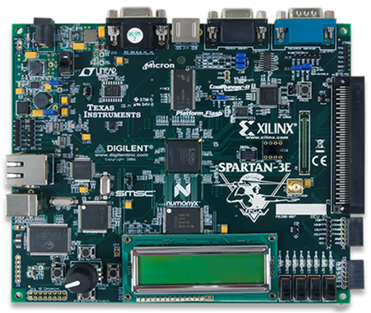
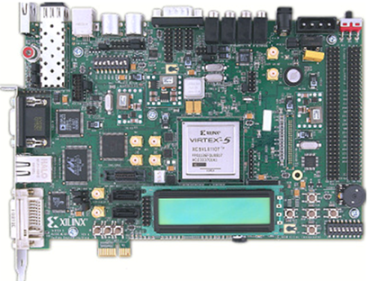
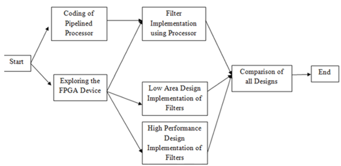
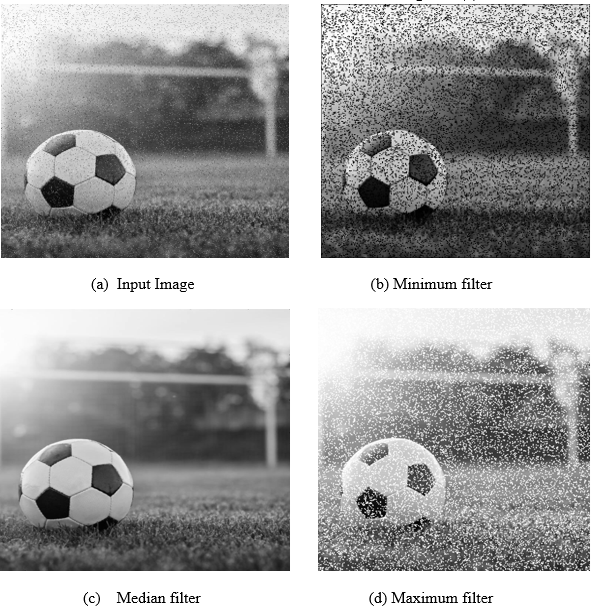
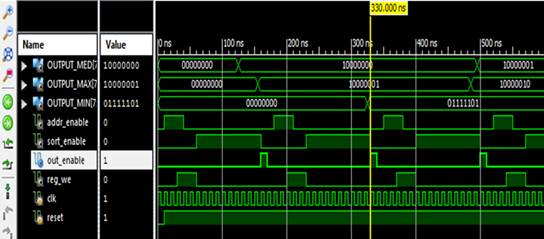
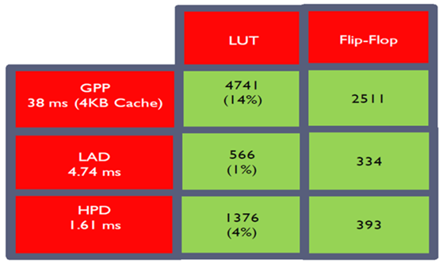
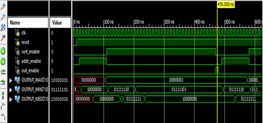

# FPGA-Based Image Processing System with Custom MIPS Processor and Hardware Accelerators

## Overview

This project implements a complete FPGA-based image processing system built around a custom-designed 32-bit pipelined MIPS processor. The system integrates instruction memory, data memory, image storage, VGA/DVI display pipeline, and two specialized hardware accelerators.

The main goal is to evaluate architectural trade-offs between:
- General-purpose pipelined processor
- Low-area hardware accelerator
- High-performance hardware accelerator

The system performs real-time image processing on FPGA and displays results through VGA/DVI output.

---

## FPGA Development Platforms

### Spartan 3E vs Virtex-5 Comparison

<table>
<tr>
<td align="center"><b>Spartan 3E FPGA (Initial Development)</b></td>
<td align="center"><b>Virtex-5 FPGA (Final Implementation)</b></td>
</tr>
<tr>
<td></td>
<td></td>
</tr>
</table>

### Key Differences

**Spartan 3E:**
- Limited RGB output (3-bit)
- Used for learning FPGA and VGA interfacing
- Lower logic and memory resources

**Virtex-5:**
- 8-bit RGB support (256 color depth)
- High-performance FPGA fabric
- Suitable for image processing and accelerators

---

## System Architecture Flow

  

System flow:

Assembly Code → Assembler → Machine Code (.bin)  
↓  
Instruction Memory → MIPS Processor → Data Memory  
↓  
Image Processing (Filters / Accelerators)  
↓  
VGA / DVI Output  

---

## Image Processing Filters

### Filter Outputs

  

Implemented filters:
- Median Filter
- Minimum Filter
- Maximum Filter

These filters operate on pixel windows using a pipelined execution model and memory-mapped image data.

---

## Hardware Accelerators

### Low Area Accelerator

  

- Optimized for minimal FPGA resource usage
- Single or limited comparator design
- Lower throughput
- Higher latency

---

### High Performance Accelerator

  

- Parallel processing architecture
- Multiple comparators / pipeline parallelism
- Higher FPGA utilization
- Faster execution time

---

## Performance Comparison

  

| Design Type               | Area Usage | Speed | Remarks |
|--------------------------|------------|-------|---------|
| General MIPS Processor   | Medium     | Medium | Baseline |
| Low Area Accelerator     | Low        | Low    | Area optimized |
| High Performance         | High       | High   | Speed optimized |

---

## Simulation Results (ModelSim)

  

### Verified in Simulation:
- Correct pipeline execution
- Instruction fetch/decode/execute flow
- Memory read/write behavior
- Filter execution correctness
- VGA data streaming validation

---

## Key Components

- 32-bit pipelined MIPS processor (Verilog HDL)
- Instruction memory (IMEM)
- Data memory (DMEM)
- Image RAM (Block RAM IP)
- VGA/DVI controller
- Java-based assembler
- Low-area hardware accelerator
- High-performance hardware accelerator

---

## Image Storage Format

Images are stored in hex format:

80  
7E  
7D  
7F  
81  

Loaded into FPGA RAM using:

initial $readmemh("image.txt", ram);

---

## Build and Execution Flow

1. Write assembly program in text file
2. Run Java assembler to generate machine code (.bin)
3. Load machine code into instruction memory
4. Load image data into RAM
5. Synthesize design using Vivado / Xilinx ISE
6. Program FPGA board
7. Observe real-time VGA/DVI output

---

## Results Summary

- Successfully implemented FPGA-based image processing pipeline
- Verified pipelined MIPS processor functionality
- Achieved real-time image rendering on VGA/DVI
- Demonstrated trade-off between area and performance
- High-performance accelerator significantly improves throughput
- Low-area design reduces FPGA resource consumption

---

## Conclusion

This project demonstrates a complete FPGA-based image processing system integrating processor design, memory architecture, VGA/DVI display system, and hardware accelerators. It highlights practical trade-offs between performance and hardware resource utilization in FPGA-based system design.

---

## Documentation

- Architecture: `docs/architecture.md`
- Processor Design: `docs/processor.md`
- Accelerators: `docs/accelerators.md`
- Display Pipeline: `docs/display_pipeline.md`
