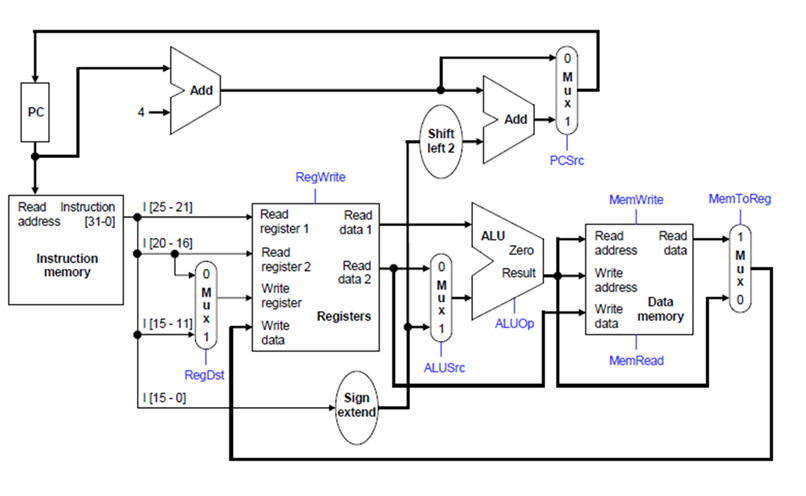

# Processor Architecture

## 1. Overview

This project implements a custom MIPS-based processor designed for FPGA-based image processing. The architecture is developed to explore trade-offs between performance and hardware area, especially when integrating hardware accelerators.

The processor executes assembly programs, interacts with memory, and drives image processing tasks whose output is displayed via a VGA/DVI interface.

---

## 2. Processor Classification

### 2.1 Instruction Set Architecture (ISA)

Processors are broadly divided into:

| RISC | CISC |
|------|------|
| Fixed instruction size | Variable instruction size |
| Simple instructions | Complex instructions |
| Highly pipelined | Less pipelined |
| Load/Store architecture | Memory access in many instructions |

This project uses a **RISC-based MIPS architecture**, where each instruction is 32 bits and optimized for pipelining.

---

### 2.2 Instruction Size

- Fixed 32-bit instruction format  
- Supports:
  - R-type (register operations)
  - I-type (immediate and memory operations)
  - J-type (control flow)

---

### 2.3 CPI (Clock Per Instruction)

| Architecture | CPI | Clock Cycle Time |
|-------------|-----|------------------|
| Single Cycle | 1 | Long |
| Multi Cycle | Variable | Short |
| Pipelined | ~1 (throughput) | Short |

---

## 3. Single Cycle Architecture

In a single-cycle architecture, each instruction completes in one clock cycle.

### Execution Stages:
- IF – Instruction Fetch  
- ID – Instruction Decode  
- EX – Execute  
- MEM – Memory Access  
- WB – Write Back  

*Figure: Single-cycle MIPS datapath*

### Limitation

The clock cycle must be long enough for the slowest instruction (e.g., Load Word), leading to inefficient performance for simpler instructions.

---

## 4. Pipelined Architecture (Overview)

To improve performance, pipelining is introduced.

- Multiple instructions execute simultaneously  
- Increases throughput  
- Reduces idle hardware time  

👉 Detailed pipeline implementation is described in [pipeline.md](pipeline.md)

---

## 5. Datapath Components

The processor consists of the following major components:

- **Program Counter (PC)** – Holds address of current instruction  
- **Instruction Memory (IM)** – Stores program instructions  
- **Register File** – Stores operands and results  
- **ALU (Arithmetic Logic Unit)** – Performs arithmetic and logic operations  
- **Data Memory (DM)** – Used for load/store operations  
- **Control Unit (CU)** – Generates control signals  
- **Multiplexers (MUX)** – Select between multiple data paths  

---

## 6. Supported Instructions

| Type | Example | Description |
|------|--------|------------|
| R-Type | add, sub | Arithmetic operations |
| I-Type | addi, lw, sw | Immediate and memory access |
| Branch | beq, bne | Conditional branching |
| Jump | j | Control transfer |

---

## 7. Design Motivation

The processor is designed to:

- Execute image processing algorithms (e.g., median filtering)  
- Interface with memory containing image data  
- Work with hardware accelerators  
- Compare **low-area vs high-performance designs**  
- Analyze **area vs throughput trade-offs**  

---

## 8. System Integration

The processor is integrated with:

- Instruction memory (loaded from `.bin` files)  
- Data memory and RAM (image storage)  
- VGA/DVI controller for display output  
- Custom accelerators for optimized processing  

This complete system enables real-time image processing on FPGA hardware.

---
