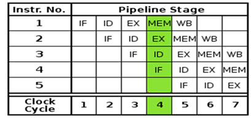
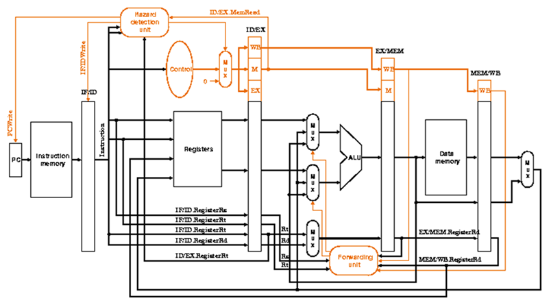

# Pipeline Architecture

## 1. Overview

Pipelining is a technique used to improve processor performance by executing multiple instructions simultaneously. Instead of completing one instruction before starting another, execution is divided into stages.

This increases **throughput**, though not individual instruction latency.

---

## 2. Pipeline Stages

The processor uses a standard 5-stage pipeline:

1. **IF (Instruction Fetch)**  
   Fetch instruction from memory using Program Counter  

2. **ID (Instruction Decode)**  
   Decode instruction and read registers  

3. **EX (Execute)**  
   Perform ALU operations  

4. **MEM (Memory Access)**  
   Read/write data memory  

5. **WB (Write Back)**  
   Write result back to register file  

*Figure: 5-stage pipelined processor*

---

## 3. Pipeline Registers

Pipeline registers store intermediate data between stages:

- **IF/ID** – Holds fetched instruction  
- **ID/EX** – Holds decoded data and control signals  
- **EX/MEM** – Holds ALU results  
- **MEM/WB** – Holds memory output  

These registers ensure smooth data flow across stages.

---

## 4. Hazards in Pipeline

Hazards occur when instructions interfere with each other.

### 4.1 Data Hazard

**Cause:**  
Dependency between instructions (e.g., using a result before it is written)

**Solution:**  
- Forwarding unit (bypassing data)  
- Pipeline stalling (if needed)

---

### 4.2 Structural Hazard

**Cause:**  
Multiple instructions competing for the same hardware resource

**Solution:**  
- Proper hardware design  
- Pipeline stalling  

---

### 4.3 Control Hazard

**Cause:**  
Branch and jump instructions changing Program Counter

**Solution:**  
- Hazard detection unit  
- Pipeline flushing  
- Branch handling logic  

*Figure: Types of pipeline hazards*

---

## 5. Advantages of Pipelining

- Higher instruction throughput  
- Efficient hardware utilization  
- Better performance compared to single-cycle design  

---

## 6. Challenges

- Hazard handling complexity  
- Additional hardware (pipeline registers, forwarding units)  
- Control logic becomes more complex  

---

## 7. Role in This Project

In this system, pipelining enables:

- Faster execution of image processing algorithms  
- Better utilization of FPGA resources  
- Integration with accelerators for improved performance  

It plays a key role in comparing:

- Low-area designs  
- High-performance designs  

---
