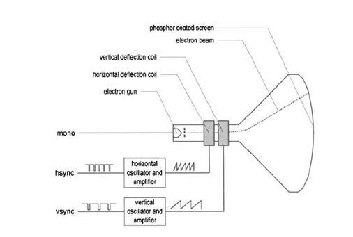
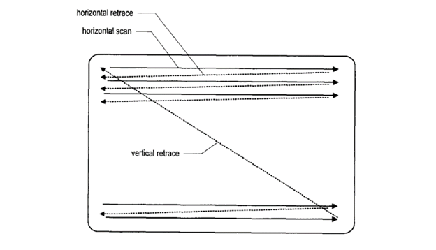
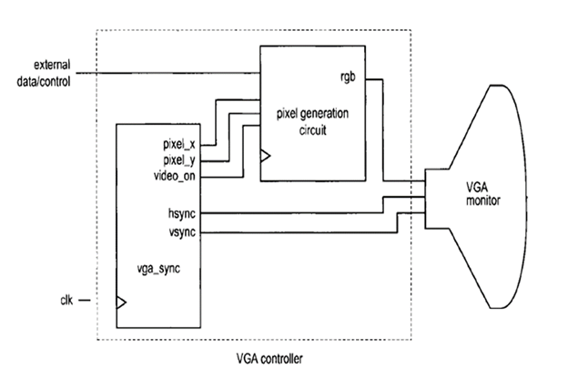
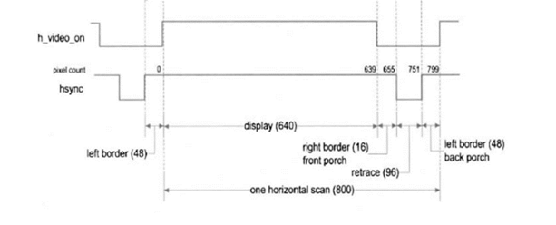
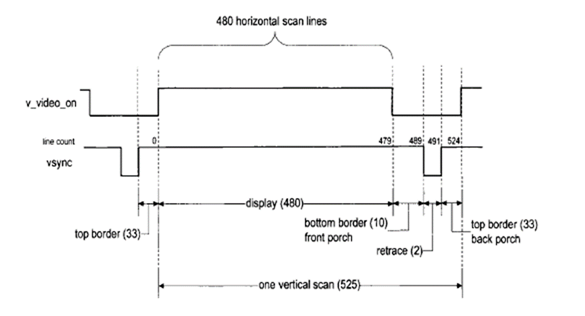

# VGA Interface and Display Pipeline

This section explains the implementation of the VGA/DVI display system used in the FPGA-based image processing design. It covers FPGA fundamentals, VGA signal generation, synchronization, and image rendering.

---

## 1. Introduction to FPGA

A **Field-Programmable Gate Array (FPGA)** is a reconfigurable integrated circuit that allows designers to implement custom digital systems.

Key features:
- Configurable logic blocks (CLBs)
- Embedded memory (Block RAM)
- Clock management resources
- Flexible I/O interfaces

FPGAs support both combinational and sequential logic and can even implement soft processors and custom accelerators.

---

## 2. SPARTAN-3E FPGA Kit

The **Xilinx SPARTAN-3E** FPGA is a low-cost and widely used prototyping platform.

### Key Features
- 50 MHz onboard clock
- VGA output port
- LEDs, switches, push buttons
- UART, PS/2, Ethernet interfaces

### Resource Summary

| Device     | Logic Cells | Block RAM | Multipliers | Max I/O |
|------------|------------|-----------|-------------|---------|
| XC3S100E   | 2,160      | 72 Kb     | 4           | 108     |
| XC3S500E   | 10,476     | 360 Kb    | 20          | 232     |
| XC3S1600E  | 33,192     | 648 Kb    | 36          | 376     |

---

## 3. VGA Interfacing Basics

---

### 3.1 CRT Display Operation

A CRT monitor generates images using an electron beam that scans across the screen.

- Moves left to right (horizontal scan)
- Moves top to bottom (vertical scan)
- Pixel intensity controlled by input signal

*Figure 1: CRT structure*

*Figure 2: Raster scan pattern*

---

### 3.2 RGB Color Model

Each pixel is composed of Red, Green, and Blue components.

| R | G | B | Color   |
|---|---|---|--------|
| 0 | 0 | 0 | Black  |
| 1 | 0 | 0 | Red    |
| 0 | 1 | 0 | Green  |
| 0 | 0 | 1 | Blue   |
| 1 | 1 | 1 | White  |

- SPARTAN-3E supports only **3-bit RGB (8 colors)**
- Later upgraded to higher color depth using Virtex-5

---

### 3.3 VGA Signals

A VGA interface uses five main signals:

- **HSYNC** → Horizontal synchronization  
- **VSYNC** → Vertical synchronization  
- **R, G, B** → Color channels  

---

## 4. VGA Controller Architecture

The VGA controller consists of:
1. Synchronization unit (vga_sync)
2. Pixel generation unit

*Figure 3: VGA controller architecture*

---

### 4.1 Synchronization Signals

- **HSYNC** controls horizontal scanning  
- **VSYNC** controls vertical scanning  
- **pixel_x, pixel_y** represent pixel coordinates  
- **video_on** defines visible display area  

---

### 4.2 Timing Requirements (640×480 @ 60Hz)

- Pixel clock: **25 MHz**
- Horizontal and vertical timing must follow strict sync patterns

*Figure 4: Horizontal timing diagram*

*Figure 5: Vertical timing diagram*

---

## 5. Learning Through Pong Game

To understand VGA interfacing, a **Pong game** was implemented.

This helped in:
- Understanding sync signals
- Handling pixel coordinates
- Generating real-time display output

---

## 6. Image Storage and Memory Mapping

### 6.1 Block RAM Usage

- Image size: **200 × 200 pixels**
- Stored using FPGA Block RAM (~320 Kb)

### 6.2 Data Initialization

- Image converted to memory file (COE / HEX)
- Loaded into RAM during initialization

### 6.3 Memory Access

- Processor accesses image via direct memory mapping
- Supports read/write operations for processing

---

## 7. Limitation of SPARTAN-3E

- Only 3-bit RGB output
- Limited to 8 colors
- Not suitable for grayscale or high-quality images

---

## 8. Migration to Virtex-5

To overcome limitations, the system was upgraded to **Virtex-5 FPGA**.

### Advantages:
- 8 bits per color (RGB)
- 256 levels per channel
- Supports detailed image rendering

---

### 8.1 DVI to VGA Output

- Virtex-5 uses DVI output
- A DVI-to-VGA converter was used
- Custom logic implemented for compatibility

---

## 9. VGA-Based Image Processing Pipeline
Image Memory → Processor / Accelerator → VGA Controller → Display

- Pixel data fetched from memory
- Processed using processor or accelerators
- Output displayed via VGA/DVI interface

---

## 10. Summary

This module demonstrates:
- VGA signal generation using FPGA
- Real-time pixel rendering
- Integration of processor, memory, and display
- Transition from basic FPGA (SPARTAN-3E) to advanced platform (Virtex-5)

